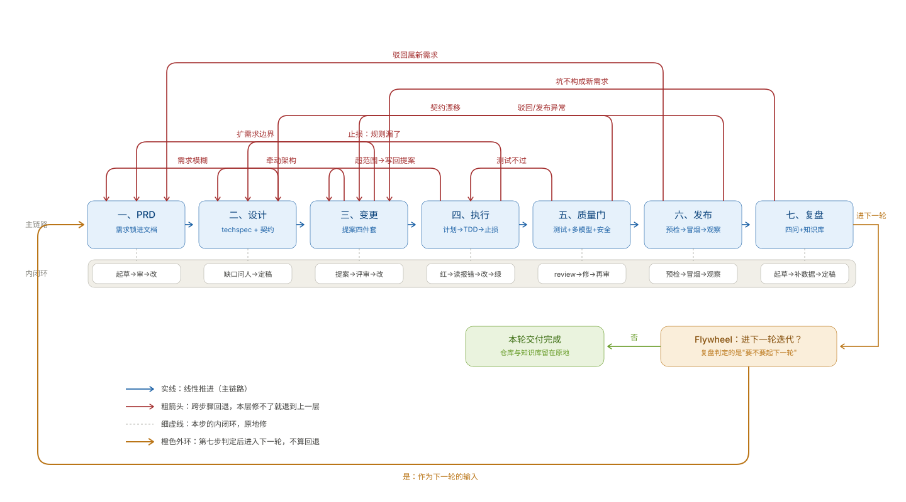
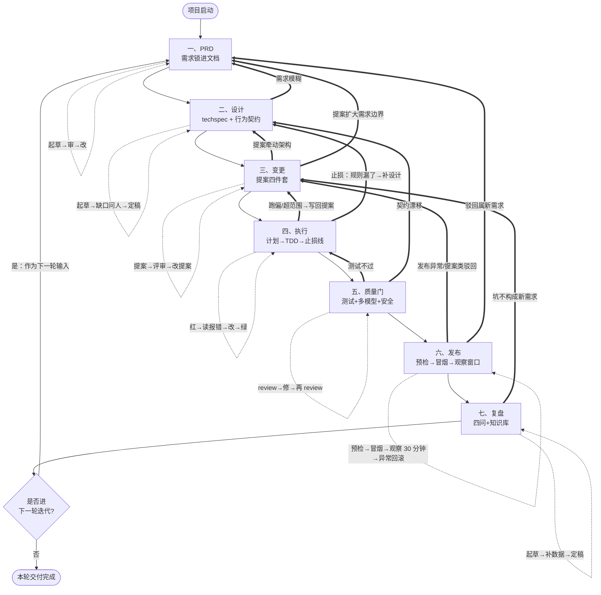
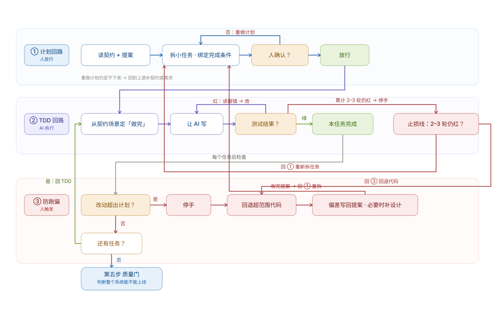
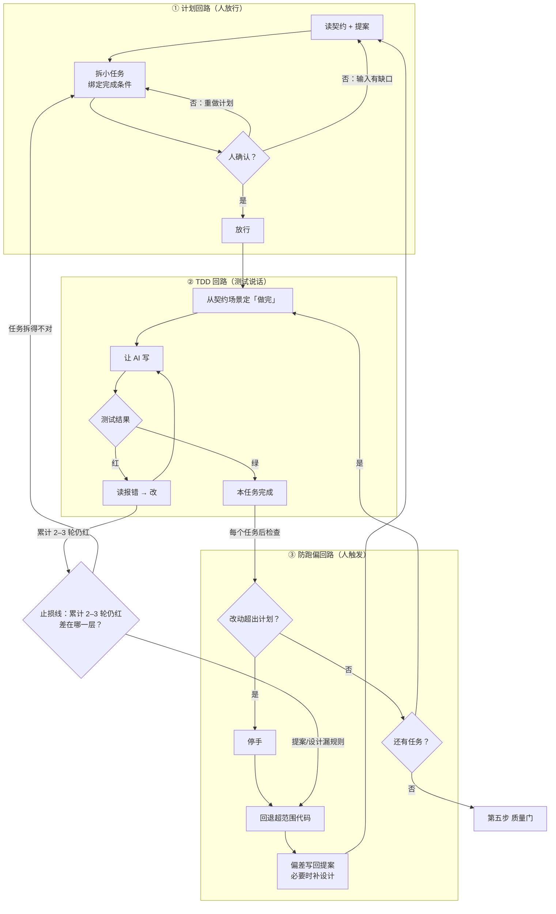

# Loop Engineering × 七步交付法 对照图

把「七步交付法」套进 Loop Engineering 框架：每一步的回路长什么样、出错往哪退。

七步是 **PRD → 设计 → 变更 → 执行 → 质量门 → 发布 → 复盘**。这份文档讲的是它底下的回路结构：每一步都不只是一次性动作，各自带着闭环和回退出口。

- 主线闭环完整，每一步都有回退出口
- 执行段（第四步）是最容易被低估的一段，单独展开成第二张图

## 一、主图：七步线性 + 每步闭环回退

每个环节不是一次性动作，而是一个有回路的循环。闭环分两类，再加一条外环：

- **内闭环**：当前步骤内部的"做—查—修"循环（如 TDD 的红绿循环）
- **跨闭环**：当某一步骤的信号异常时，回退到上游步骤（最常见是回退到提案重新定义）
- **外环**：第七步复盘判定后回到第一步，这不算回退，它是下一轮的输入（见图中 flywheel 节点）

**内闭环和跨闭环怎么分：**

- 内闭环：本步的产出还没合格，原地修。比如测试红了、review 没过、图没画对。
- 跨闭环：本步干完了，但发现上游给的输入是错的。比如 PRD 需求模糊、设计定错、执行跑偏超出提案范围。
- 一句话：问题出在哪一步，就退到哪一步；本步没干完，在本步修。
- 两类闭环在图上用两种线型分开：内闭环是细虚线自环，跨闭环是粗箭头。粗箭头指向哪里，代表"这一层修不了，去那一层修"。

**怎么读这张图：**

- 实线箭头 = 线性推进（主链路）
- 细虚线 = 当前步骤的内闭环：本步没干完，在本步修
- 红粗箭头 = 跨步骤回退：本步干完了，但发现上游给的输入错了，按问题所在层退回来。10 条回退按跨了几步分层，跳一步的在最下层，跳三步以上的升到高层
- 橙色外环 = 飞轮的"是→P1"，唯一一条往回走的实线，它代表下一轮的输入，不算回退

**教学重点：第七步的 flywheel 节点**——复盘不是为了收尾，而是判定要不要起下一轮迭代。这是 Loop Engineering 和瀑布模型最本质的区别：**链条从不"结束"**。

**"否"分支怎么理解：** 它指向的是"本轮交付完成"，不是项目终结。仓库、文档、知识库都留在原地，下一轮可以随时从 P1 起。

**复盘两条出路怎么分：** 复盘发现的坑，本轮能修、不算新需求 → 回 P3 走提案修掉；坑意味着新需求、或时机到了 → 进下一轮回 P1。

**发布环节为什么有两条回退边：** 小程序审核驳回要先判定意见属于哪一类——属新需求走 P1，属技术提案、内容或合规问题走 P3。问题出在哪一层，就退到哪一层，发布环节同样不例外。

**第六步的内闭环里藏着观察窗口：** 冒烟全过还不算完，30 分钟内盯错误率、请求延迟、数据库连接数、关键业务失败数，哪条线越了阈值直接回滚。这是"发布可预期"的核心动作，所以它画在内环上，不在外环。

**为什么多数回退箭头落在 P3（提案）而不是一路退回 PRD：** 提案是成本最低、可追溯的修改单元。改动先落到提案上，能改则改，改不动再继续往上游退。这是刻意设计，不是随手画箭头。

展开 Mermaid 源码（与上图同一结构，便于复制改写）

## 二、细节图：执行回路（第四步）的展开

第四步是 Loop Engineering 里最容易被低估的环节，因为真正决定 AI 项目成败的是**它**。它下面有三个嵌套闭环，外加一条从 TDD 回路伸出来的止损线：

### 三个嵌套闭环的责任分工

| 回路 | 解决什么问题 | 谁驱动 | 失败信号 |
| --- | --- | --- | --- |
| ① 计划回路 | 不让人和 AI 自由发挥 | 人 | 计划没人确认就开干 |
| ② TDD 回路 | 让"做完"可验证 | AI | 测试没跑就说"做完了" |
| ② 的止损出口 | 不在错的地基上死磕 | 人判定 | 同一任务连续 2–3 轮仍红 |
| ③ 防跑偏回路 | 不在错的地基上盖楼 | 人触发 | AI 改了计划外的文件 |

**三个回路怎么分工到人：** 计划放行、止损判定、最终合并由人拍板；红绿循环 AI 自己跑，人只看最后是不是绿。

**③ 要盯的三个信号：** 改动超过计划、修改了与任务无关的文件、开始顺手重构或顺手换技术。任何一个出现就停手，不在当前结果上继续打补丁。

**为什么止损线必须有：** 没有它，②TDD 回路就是一个没有终止条件的死循环。同一个任务连续两三轮修不好，缺的通常不是第四个判断，而是上游设计漏了规则。这时候停手，判断差在哪一层——任务拆得不对就回 ①，提案或设计漏了规则就回退代码、写回提案，再继续往上游退到第二步补设计。

**原话对应：**

- ① 计划回路 → "把需求拆成可独立验证的小任务，一次只动一块。计划先给人确认，再放行。"
- ② TDD 回路 → "执行靠测试说话。先定义'做完'长什么样，再让 AI 写。"
- ② 的止损出口 → "两三轮还红，停下来回第三步改提案重新拆——不死磕，死磕的补丁会变三个。"
- ③ 防跑偏回路 → "跑偏会来：信号出现就停手、回退，把偏差写回提案。"

③ 里的"偏差写回提案"对应主图的 P4→P3 回退：先改第三步的提案，再回到 ① 重新拆任务。止损线里的"规则漏了"对应主图的 P4→P2：一致性规则要回到第二步的设计和契约里重新定义。

展开 Mermaid 源码（与上图同一结构，便于复制改写）

## 三、Loop Engineering 框架里的盲点

七步法这套**方法论**本身没覆盖的回路，以及该把每条补进第几步。

| 缺失回路 | 作用 | 该放进第几步 | 何时需要 |
| --- | --- | --- | --- |
| **指标定义前置**（不是新回路，是第二步的补丁） | 指标跟行为契约一起定，每个关键状态至少有一个可观测事件 | 第二步契约内部 | 只要复盘想要数据，现在就需要 |
| **可观测性回路** | 线上数据→发现新问题→写回提案 | 第六步与第七步之间新增 | 上线后持续运营就需要 |
| **变异测试夜间基线回路** | 慢速检查夜间跑，存活率退步自动建问题 | 第七步（或挂在第六步旁） | 有又慢又有价值的检查时 |
| **A/B 实验回路** | 用数据反推方案优选 | 第六步与第七步之间新增 | 产品化后期（从 1 到 N） |
| **灰度发布回路** | 小流量验证，降低发布风险 | 第六步内部 | 流量大了、不能一次全量时 |

**第一行为什么单独列：** 指标不是发布之后才想的事。优惠券那个坑就是例子——券发出去了三千多张，领、占用、核销、释放四个事件只记了一个，最后复盘只能写"运行稳定"。规矩定在契约层：指标跟行为契约一起定。事件定义不到位，后面的可观测性回路再全也捞不回数据。

**后四条在"从 0 到 1 交付"阶段可以先不做**，做"从 1 到 N"时再补。

## 四、一句话总结

> **Loop Engineering 是理论框架，七步交付法是它在一套完整交付里的落地。主线闭环完整，每层都有回退出口；指标前置、可观测性、夜间基线、灰度、A/B 这几条，等做"从 1 到 N"再补。**
