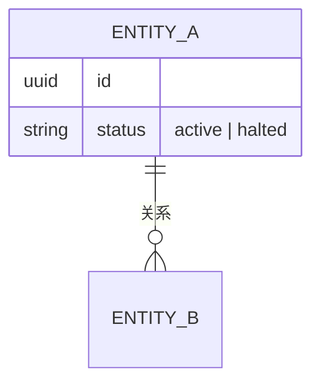
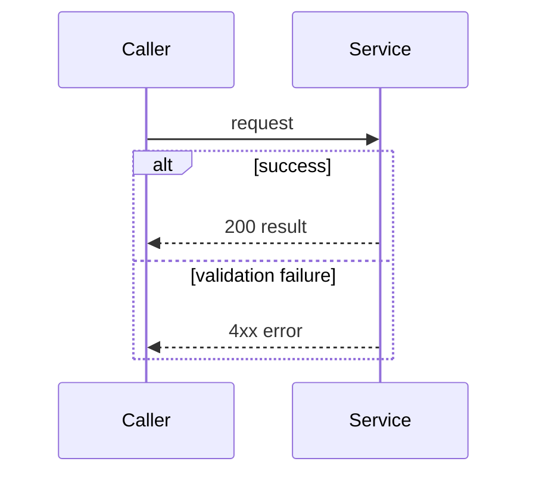

# Techspec Canon

## 基本规则

techspec 只写当前有效的工程决策，使用简洁、自然的工程语言。它不承载来源对账、旧方案、重命名历史、漂移记录、Open Question、TODO、假设或 follow-up。

证据写入同基名 `.evidence.md`，待补的非关键事项写入同基名 `.follow-ups.md`，都不进入正文。证据优先级和来源限制见 `SKILL.md`；正文只采用已经确认或核实的当前事实。

输出默认中文；Mermaid、JSON、路径和代码标识符保持工程语言原样。不要发明只在本 skill 内使用的术语。

## 固定结构

五个常驻章节顺序固定，必须全部保留：

| # | 章节 | 用途 |
|---|---|---|
| 1 | 背景与目标 | 工程背景、用户结果和本功能成功标准 |
| 2 | 功能需求 | 可独立验证的行为，写明发起方或调用方 |
| 3 | 数据模型 | 新增或变更的实体、字段、约束和关系图 |
| 4 | 流程 | 主流程和必要分支的时序图或状态图 |
| 5 | 接口契约 | 已确认的端点、事件或跨系统交互 |

章节不适用时保留标题，用一句自然工程语言说明原因。例如：

- §3：`本功能不新增持久化状态，复用现有订单记录。`
- §4：`本功能不新增异步或后台处理流程。`
- §5：`本功能不新增对外接口。`

## 形态：单文件与文档集

techspec 有两种形态，判断标准：这份 spec 要不要长期给团队多人当对齐基准、会不会持续演进——要，就文档集；个人草稿、简单 feature 用单文件，后续需要时再拆。

- **单文件**：五个章节都在一个文件里，内容齐全到不用看别的文件。适用于个人草稿、简单 feature。
- **文档集**：入口文件放结构大纲（§1 背景、§2 功能需求、§3 ER 概览、§4 鸟瞰流程图、§5 端点清单；其中 §3/§5 配指向详情文件的链接），详情文件放具体内容（表结构 / 接口契约 / 详细流程）。适用于团队共享、复杂、长期演进的正式 spec。

文档集下固定结构仍成立，但分散到各文件：入口文件必含全部 5 个 section title（顺序不变），§3/§5 可"导航式"——一行链接 + 概要（ER 图概要 / 端点清单）；整套（入口 + 全部详情）满足五段完整性，入口文件是分散，不是省略；单看入口文件不够，要连同全部详情文件一起读才算齐全。

## 模板

复制后必须填掉或删除所有 `<...>`。不能保留模板字或“待定”表述。

```markdown
# Tech Spec：<功能名>

| 字段 | 值 |
|---|---|
| PRD 来源 | <路径或链接，或“无”> |
| 关联 ticket | <TICKET-ID，或“无”> |
| 负责服务 | <service 名，或“无”> |
| 状态 | 草稿 |
| 更新日期 | <YYYY-MM-DD> |

## 1. 背景与目标

<用 2-4 句说明工程背景和用户得到的结果。工程背景可含一句工程动机（为什么需要这个实现），但不展开业务战略、技术痛点或触发契机——那些在 PRD。成功指标只写本功能的标准。关键范围限制就近写入，不另起非目标章节。>

## 2. 功能需求

- <由具体服务、角色或任务发起的可验证行为>

## 3. 数据模型

<新增或变更的实体、字段、类型和决策性约束；若不新增状态，写明复用对象。保留实现所需的字段 shape 和约束，不复制外部源文档的完整 DDL。每个新增字段须标注来源：请求或上游输入、既有数据或迁移、用户确认的目标设计、服务自行生成的值，或派生逻辑（注明依赖字段或计算）。来源或行为未确认的字段进 follow-ups。涉及持久化时，每类记录须说明写入语义（insert-once / upsert / append）；有下游消费契约（API/事件）时，须做字段完整性审计。>



## 4. 流程

<说明从触发到可观察结果的主流程。错误或边界分支使用同一张图中的 alt / opt 表达。摄入、处理、持久化、补偿和对外输出等阶段仅在功能实际涉及时说明；不涉及时自然写明，不虚构阶段。涉及异步补偿或历史数据处理时，说明漏块续扫、坏数据重处理或历史回填；没有异步补偿任务时明确写明。>



## 5. 接口契约

<只写已经确认的端点、事件或跨系统交互；不新增接口时自然说明。>

### `POST /api/v1/<resource>` — <一句话目的>

- **请求：** `<结构或示例载荷>`
- **响应（成功）：** `<结构或示例>`
- **响应（错误）：** `<错误码和触发条件>`
```

新建 spec 必填顶部元数据表；重塑已有 spec 时，原稿没有这张表就不强加。

## 内容规则

- §1 写工程背景和用户结果，不复述 PRD 的营销表达，也不预览 §3 的结构清单。
- §2 的每项可独立验证，明确具体调用方、服务或任务，不泛称“用户”。
- §2 只写可验证行为和职责边界；字段、enum、状态机转换、流程步骤和接口契约分别属于 §3/§4/§5，§2 不重述，需要时引用对应章节。
- §3 写必要的字段 shape、类型、约束和完整的已确认 enum 值。严格可推导的字段可以写；需要猜测的 enum 值、约束或新字段不能写。
- §3 可以写“需迁移现有数据以支持 `<目标字段>`”，但不保留旧字段名或改名历史。
- §3 每个新增字段须标注来源：请求或上游输入、既有数据或迁移、用户确认的目标设计、服务自行生成的值，或派生逻辑（注明依赖字段或计算）。只有来源或行为未确认的字段进 follow-ups。涉及持久化时，每类记录须说明写入语义（insert-once/upsert/append）；有下游消费契约时，对照其做字段完整性审计，缺失字段进 follow-ups。
- §4 每个主流程一张图；错误分支用 `alt` 或 `opt` 折入主图。非主流程失败分支未定义时，保持在 follow-ups，不在图中编造。
- §4 主流程从触发覆盖到可观察结果，说明功能实际涉及的摄入、处理、持久化、补偿和对外输出阶段；不涉及的阶段自然说明，不虚构。涉及异步补偿或历史数据处理时，说明补偿/backfill 任务（漏块续扫、坏数据重处理、历史回填）；没有异步补偿任务时明确说明。
- §5 写已确认的 method、path、请求、成功响应和错误行为。接口细节未确认且不阻塞主流程时，只写已确认的系统交互关系；未确认细节进入 follow-ups。
- 不重述平台通用鉴权、幂等、PII、告警或运维约定。与本功能直接相关的成功标准可写在 §1。
- 不复制其他仓库或源文档中的完整 DDL、源码或大段原文；保留本 feature 需要的结构、增量和决策性约束即可。
- 内部术语或缩写（项目代号、服务简称、协议缩写）首次出现时展开全称或一句说明；行业通用术语（TP/SL、API）可保留，但读者无法从上下文推断的缩写必须展开。
- **指针规则**：一个 section 能不能直接写"见某文件"当作该 section 的内容，取决于指向哪。
  1. 指向同一工作区中随输入包提供的详情文件（文档集内部链接）→ 可当 section 内容。入口文件 §3 可写"完整表结构见同目录 `db_schema_design.md`" + ER 图概要。整套一起算齐全，详情文件不会和入口文件对不上。
  2. 指向别处权威源文档（别的仓库 / 团队 spec）→ 只当溯源备注，不当 section 内容。section 得自己写结构概要 + 决策性约束（如唯一索引、WHERE 条件、去重兜底），别搬完整 DDL。
  3. 纯废话指针（“真正的 X 在文件 Y”，自己啥都不写）→ 一律禁，不管指向哪。
- **可读性/分组**：一段连续文字或一个扁平列表里，有好几个不同的决策或关注点挤在一起、且没有任何结构（子标题、加粗分组头、分段、子列表标签）把它们隔开 → 需引入命名分组（加粗分组头/子标题），叙述段先拆 bullet 或分段，只在反复出现的决策锚点/硬限制/约束名上加粗该词。**不误杀**：单一内聚种类的扁平列表（一张表的字段列表、一个 enum 的取值、一个端点的参数列表）不命中，留扁平。触发用语义条件（“是不是好几个没隔开的关注点挤一起”），不写数字阈值——LLM 计数不稳，数字会被当成硬阈值导致误杀。
- **品味边界**：reviewer 只执行能写成规则、有明确对错的品味（如上各条 + 既有不复制 DDL、§1 无营销、§2 不重述、不留 OQ/历史叙事、不收 NFR/平台约定、缩写展开、决策有据）；没写成规则的主观设计判断（该不该用 event sourcing、`action_id` 是不是对的去重边界、状态机设计合不合理、抽象层级高低、业务取舍）不报，留给人判断。每把一条品味写成 canon 规则，reviewer 就多一条能引的——这是“品味进 skill”的唯一通道，不靠给 reviewer 留自由判断的余地。

## Mermaid 约定

- 使用内嵌 Mermaid。
- 实体、字段、enum 和流程名称必须与正文一致。
- `sequenceDiagram` 中不要使用 `;`。
- 需要状态机时使用 `stateDiagram-v2`；服务或资金流总览使用 `flowchart`。
- Mermaid 语法细节使用 mermaid-diagrams skill。

## 可交付自检清单

- [ ] 五个常驻章节齐全、顺序正确；不适用章节有自然的简短说明
- [ ] 无 `<...>`、模板字、待定项、Open Question、TODO、假设或来源/附件编号
- [ ] §1 是工程背景和用户结果，不含营销表达或数据结构预告
- [ ] §1 若有成功标准，可验证且限于本功能；无明确标准时不编造
- [ ] §1 若有 Why，限一句工程动机，不展开业务/痛点/契机
- [ ] §2 的行为可验证，调用方明确
- [ ] §2 不重复 §3/§4/§5 的实现细节，引用而非重述
- [ ] 字段、enum、约束和新设计均有当前有效依据；未猜测字段、枚举、机制或协议
- [ ] §3 的字段 shape、决策性约束和数据迁移信息足以实现，但未复制完整外部 DDL
- [ ] §3、ER 图、§5 和状态图中的名称、enum、约束一致
- [ ] §4 覆盖主流程，错误分支没有拆成重复图；未定义的非关键分支不被编造
- [ ] §3 每个新增字段标注了输入、既有数据/迁移、用户确认设计、服务自行生成的值或派生逻辑来源；来源或行为未确认的字段进了 follow-ups
- [ ] 涉及持久化时，§3 每类记录说明了写入语义（insert-once / upsert / append）
- [ ] 有下游消费契约（API/事件）时，§3 已对照其做字段完整性审计，缺失字段进了 follow-ups
- [ ] §4 从触发覆盖到可观察结果，包含所有实际涉及的阶段；不涉及的阶段未被虚构
- [ ] 涉及异步补偿或历史数据处理时，§4 说明了补偿/backfill 任务；没有异步补偿任务时已明确说明
- [ ] §5 只描述已确认接口或交互；不新增接口时有自然说明
- [ ] 无平台通用 NFR、历史叙事、对账过程或重复散文
- [ ] 内部术语和缩写首次出现已展开全称或说明
- [ ] Mermaid 合法，`sequenceDiagram` 无 `;`
- [ ] 中文输出，或遵循 PRD / 目标仓库既有语言
- [ ] 文档集形态下入口文件 5 个 section title 齐全、顺序正确
- [ ] 文档集形态下入口文件的 §3/§5 导航式链接指向同一工作区中真实存在的详情文件、且内容对得上（无跨文件漂移）
- [ ] 指针符合三类规则：同仓详情可当内容、外部源文档只溯源、无纯废话指针
- [ ] 无“好几个没隔开的关注点挤一起”的连续文字段或长扁平列表；长扁平列表要么已分组、要么属单一内聚种类
